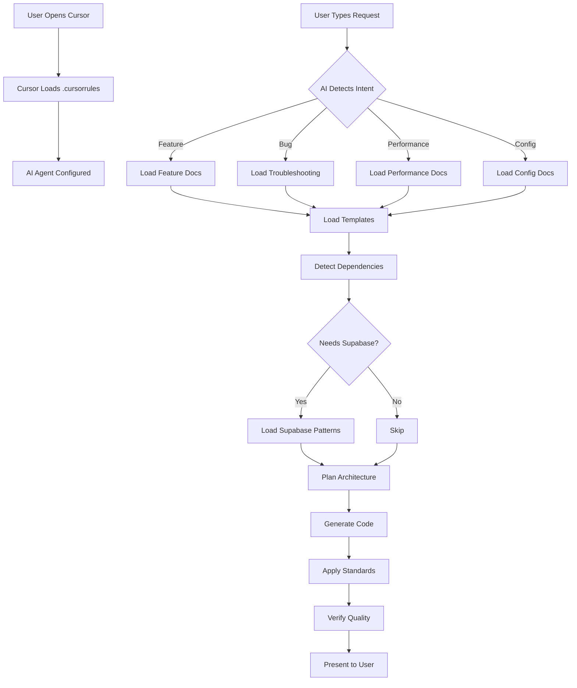

# How the AI-Powered Framework Works

> **"Write what you need. AI does everything else."**

## 🎯 The Magic Behind the Scenes

When you write a simple request like:

```
Treba mi lista proizvoda s filtriranjem
```

Here's what happens automatically:

### 1. Cursor Loads Configuration

```
Cursor Editor starts
  ↓
Automatically reads: /.cursorrules
  ↓
AI Agent configured with:
  • Intent detection rules
  • Documentation paths
  • Dependency patterns
  • Implementation standards
```

### 2. AI Detects Intent

```typescript
// AI Mental Process (Automatic)

User Input: "Treba mi lista proizvoda s filtriranjem"

Intent Analysis:
  Keywords: "lista" (list), "filtriranjem" (filtering)
  → Detected: CRUD Feature Request
  
Context Inference:
  "proizvoda" (products) = Database entity
  "lista" = List view required
  "filtriranjem" = Filter/search functionality
```

### 3. AI Loads Documentation

```typescript
// Based on Intent, AI Automatically Reads:

Primary Docs:
  ✓ docs/07_FEATURE_TEMPLATE.md
  ✓ docs/04_CLEAN_ARCHITECTURE.md
  ✓ docs/05_STATE_MANAGEMENT.md
  ✓ docs/06_ERROR_HANDLING.md
  ✓ docs/09_DATA_LAYER.md
  ✓ docs/11_DESIGN_SYSTEM.md

Templates:
  ✓ docs/templates/repository_template.dart
  ✓ docs/templates/notifier_template.dart
  ✓ docs/templates/model_template.dart
  ✓ docs/templates/entity_template.dart
  ✓ docs/templates/page_template.dart
  ✓ docs/templates/widget_template.dart
```

### 4. AI Detects Dependencies

```typescript
// Smart Dependency Detection

Feature: Products list with filtering
  
Auto-Detected Dependencies:
  ✅ Supabase - Data storage
  ✅ BaseNotifier - State management
  ✅ Either pattern - Error handling
  ✅ go_router - Navigation
  ✅ ListView.builder - Performance
  ✅ Pull-to-refresh - UX
  ✅ Search/filter - Functionality
  ✅ Pagination - Performance (if many items)
  ✅ Image caching - Product images
  ✅ Design system - Consistent styling
```

### 5. AI Plans Architecture

```typescript
// Implementation Plan (Internal)

Database:
  Table: products
  Fields: id, name, description, price, category_id, image_url
  RLS: Enabled

Data Layer:
  • ProductModel (Supabase JSON ↔ Dart)
  • ProductRepository (CRUD + filtering)
  • Category filtering logic
  
Domain Layer:
  • ProductEntity (Business model)
  • ProductsListNotifier (State management)
  • Filter state management

Presentation Layer:
  • ProductsListPage (Main screen)
  • ProductListItem (Widget)
  • FilterBottomSheet (Filter UI)
  • SearchBar widget
```

### 6. AI Implements Everything

```dart
// AI Creates All These Files Automatically:

features/products/
├── data/
│   ├── models/
│   │   └── product_model.dart         ← Supabase JSON model
│   └── repositories/
│       └── product_repository.dart    ← CRUD + filter logic
│
├── domain/
│   ├── entities/
│   │   └── product_entity.dart        ← Business entity
│   └── notifiers/
│       └── products_list_notifier.dart ← State management
│
└── presentation/
    ├── pages/
    │   └── products_list_page.dart    ← Main screen
    └── widgets/
        ├── product_list_item.dart     ← List item widget
        ├── filter_bottom_sheet.dart   ← Filter UI
        └── product_search_bar.dart    ← Search widget

// Plus:
// - Navigation routes in router config
// - Loading/error/empty states
// - Pull-to-refresh
// - Design system applied (colors, typography, spacing)
// - Error handling with Either pattern
// - User-friendly error messages
```

### 7. AI Applies Standards

```dart
// Every Generated File Follows Standards:

✅ Clean Architecture (proper layer separation)
✅ BaseNotifier pattern (q_architecture)
✅ Either pattern (either_dart)
✅ Design system (AppColors, AppTextStyles)
✅ Error handling (try-catch, user messages)
✅ Loading states (shimmer effects)
✅ Empty states (helpful messages)
✅ Const constructors (performance)
✅ Null safety (required, ?, ??)
✅ Comments (complex logic explained)
```

### 8. AI Presents Complete Solution

```
Bok! Implementirao sam products feature s filtriranjem.

✅ Database Schema (SQL)
✅ Data Layer (model + repository)
✅ Domain Layer (entity + notifier)
✅ Presentation Layer (pages + widgets)
✅ Navigation configured
✅ Filtering by category
✅ Search functionality
✅ Loading/error/empty states
✅ Pull-to-refresh
✅ Design system applied

[Shows all the code]
```

---

## 🔄 The Configuration Flow



---

## 📚 Why This Works

### 1. Cursor's .cursorrules File

Cursor **automatically** loads `.cursorrules` file when you open the project. This file contains:

- Intent detection patterns
- Documentation references
- Implementation standards
- Dependency inference rules

**You never need to manually reference it!**

### 2. Documentation-Driven Development

All patterns, standards, and templates are documented in `docs/` folder:

- **Clear patterns** - AI knows exactly how to structure code
- **Templates** - Starting point for every component
- **Checklists** - Quality verification
- **Examples** - Real-world reference

### 3. Smart Inference

AI doesn't just follow instructions blindly. It infers:

- **Dependencies** - "List" → Needs pagination, filtering
- **Patterns** - "Data" → Needs Supabase, repository, caching
- **Standards** - Always applies design system, error handling, loading states

### 4. Zero Configuration Needed

You don't need to:
- ❌ Tell AI to use Supabase (it knows when needed)
- ❌ Tell AI to add error handling (always added)
- ❌ Tell AI to use design system (always applied)
- ❌ Tell AI which template to use (auto-detected)
- ❌ Reference documentation manually (AI reads it)

---

## 🎨 Real Example: From Request to Implementation

### User Input

```
Treba mi autentifikacija s login i register
```

### AI Processing (Automatic)

```typescript
// 1. Intent Detection
Type: Authentication Feature
Complexity: Medium
Keywords: "autentifikacija", "login", "register"

// 2. Documentation Loading
→ docs/09_DATA_LAYER.md (Supabase Auth section)
→ docs/08_NAVIGATION_SYSTEM.md (Route guards)
→ docs/06_ERROR_HANDLING.md (Auth errors)
→ docs/07_FEATURE_TEMPLATE.md
→ docs/templates/*.dart

// 3. Dependency Detection
✅ Supabase Auth (authentication provider)
✅ Secure storage (token persistence)
✅ Route guards (go_router redirects)
✅ BaseNotifier (auth state management)
✅ Form validation (email, password)
✅ Error handling (wrong credentials, etc.)

// 4. Architecture Plan
Features:
  - Login page
  - Register page
  - Forgot password page
  - Auth state management
  - Route protection
  - Token refresh logic

Layers:
  Data:
    - AuthRepository (Supabase Auth)
    - Token storage
  Domain:
    - UserEntity
    - AuthNotifier (state: authenticated/unauthenticated)
  Presentation:
    - LoginPage
    - RegisterPage
    - ForgotPasswordPage

// 5. Implementation
[Generates 12+ files with complete auth system]

// 6. Quality Checks
✅ Secure token storage
✅ Route guards configured
✅ Error messages (user-friendly)
✅ Loading states (authenticating...)
✅ Email validation
✅ Password strength check
✅ Design system applied
```

### Output

Complete authentication system with:
- Login/Register/Forgot Password pages
- Supabase Auth integration
- Route protection
- Token management
- Error handling
- Validation
- Loading states

**All in ~2 minutes!** ⚡

---

## 💡 Key Takeaways

1. **`.cursorrules`** - Brain of the AI, automatically loaded by Cursor
2. **`docs/`** - Knowledge base, automatically referenced by AI
3. **Templates** - Starting points for every component
4. **Smart inference** - AI detects what you need before you say it
5. **Zero manual work** - Just write what you want, AI handles rest

---

## 🚀 What You Need to Know

**As a Developer:**

1. Write simple, natural requests
2. AI automatically detects intent and dependencies
3. AI loads relevant documentation
4. AI implements complete solution
5. Review and test

**That's it!** 🎉

---

## 🔗 Learn More

- **User Guide**: [`QUICK_START.md`](QUICK_START.md)
- **AI Navigation**: [`AI_NAVIGATION.md`](AI_NAVIGATION.md)
- **Full Index**: [`MASTER_GUIDE.md`](MASTER_GUIDE.md)
- **Request Templates**: [`examples/feature_request_template.md`](examples/feature_request_template.md)
- **Workflow Examples**: [`examples/ai_workflow_examples.md`](examples/ai_workflow_examples.md)

