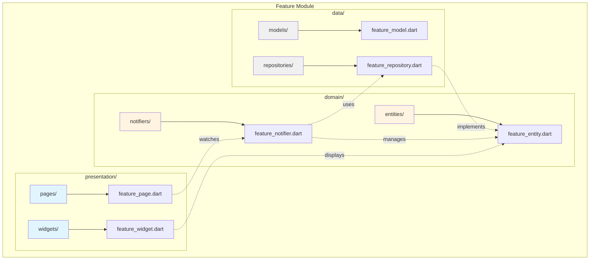

# Feature Structure Diagram



## Standard Feature Structure

```
features/
└── feature_name/
    ├── data/
    │   ├── models/
    │   │   └── feature_model.dart
    │   └── repositories/
    │       └── feature_repository.dart
    ├── domain/
    │   ├── entities/
    │   │   └── feature_entity.dart
    │   └── notifiers/
    │       ├── feature_notifier.dart
    │       └── feature_list_notifier.dart
    └── presentation/
        ├── pages/
        │   ├── feature_page.dart
        │   └── feature_details_page.dart
        └── widgets/
            └── feature_list_item.dart
```

