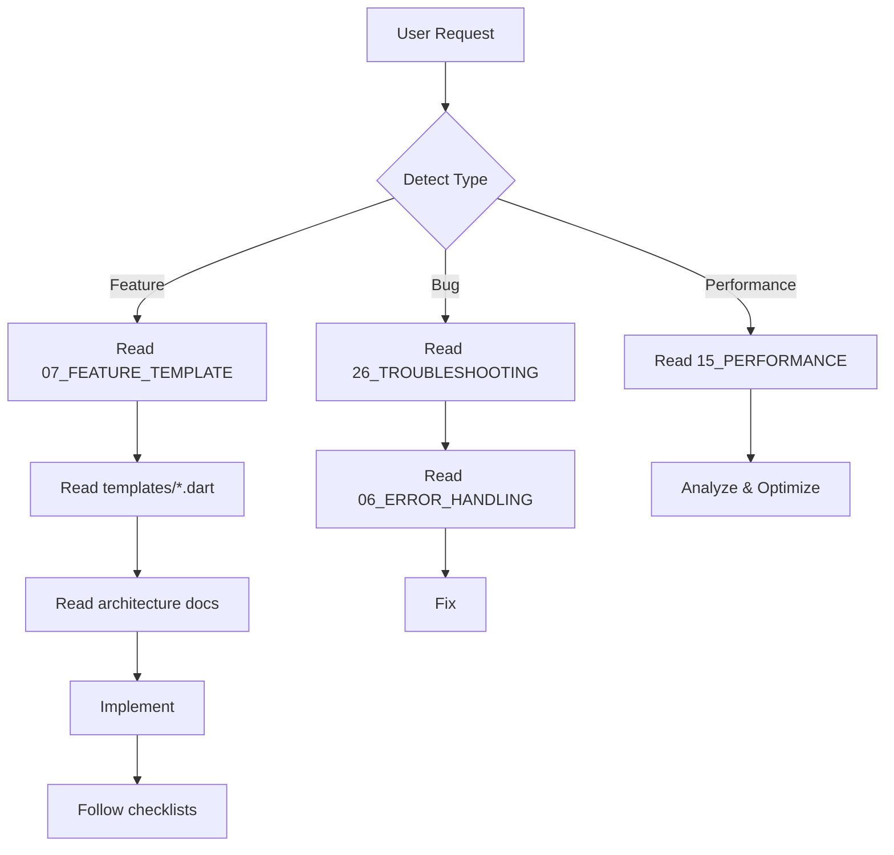

# AI Navigation System

> **Za AI Asistenta: Automatski čitaj ovaj fajl za svaki request!**

## 🎯 Kako Funkcionira

1. **User napiše zahtjev** - jednostavno, natural language
2. **Ti (AI) automatski:**
   - Detektuješ tip zahtjeva
   - Čitaš relevantne dokumente (bez pitanja!)
   - Implementiraš prema guidelines
3. **User dobije rezultat** - bez ručnog referenciranja

## 📊 Request Type Detection & Auto-Documentation Mapping

### Feature Request Detection

**Trigger Keywords:** `treba mi`, `nova feature`, `dodaj`, `napravi`, `feature`, `implement`

**Auto-read (in this order):**
```
1. docs/07_FEATURE_TEMPLATE.md
2. docs/29_PAGE_WIDGET_BEST_PRACTICES.md ⭐ CRITICAL
3. docs/templates/repository_template.dart
4. docs/templates/notifier_template.dart
5. docs/templates/model_template.dart
6. docs/templates/entity_template.dart
7. docs/templates/page_template.dart
8. docs/04_CLEAN_ARCHITECTURE.md
9. docs/05_STATE_MANAGEMENT.md
10. docs/06_ERROR_HANDLING.md
11. docs/11_DESIGN_SYSTEM.md
```

**Example:**
- User: "Treba mi lista proizvoda"
- AI: [Auto-reads above files] → Implements complete feature

---

### Bug Fix Detection

**Trigger Keywords:** `bug`, `error`, `crashuje`, `ne radi`, `problem`, `issue`

**Auto-read:**
```
1. docs/26_TROUBLESHOOTING.md
2. docs/06_ERROR_HANDLING.md
3. Analyze code
4. Implement fix
```

**Example:**
- User: "App crashuje kad nema interneta"
- AI: [Auto-reads troubleshooting] → Fixes network error handling

---

### Performance Issue Detection

**Trigger Keywords:** `sporo`, `laguje`, `performance`, `slow`, `optimizacija`

**Auto-read:**
```
1. docs/15_PERFORMANCE_OPTIMIZATION.md
2. docs/09_DATA_LAYER.md (if data-related)
3. Profile and fix
```

**Example:**
- User: "Lista laguje pri scrollanju"
- AI: [Auto-reads performance guide] → Implements ListView.builder, pagination, etc.

---

### Configuration/Setup Detection

**Trigger Keywords:** `setup`, `config`, `kako`, `install`, `environment`

**Auto-read:**
```
1. Search docs/ for relevant config file
2. docs/01_PROJECT_INITIALIZATION.md (if new project)
3. docs/03_ENVIRONMENT_CONFIG.md (if env-related)
4. docs/20_IOS_CONFIGURATION.md (if iOS)
5. docs/21_ANDROID_CONFIGURATION.md (if Android)
```

**Example:**
- User: "Kako setup iOS build?"
- AI: [Auto-reads iOS config] → Guides through setup

---

### Design/UI Detection

**Trigger Keywords:** `dizajn`, `UI`, `stil`, `boja`, `izgled`, `animation`

**Auto-read:**
```
1. docs/11_DESIGN_SYSTEM.md
2. docs/10_UI_COMPONENT_LIBRARY.md
3. docs/12_ANIMATION_GUIDELINES.md (if animation)
```

---

### Testing Detection

**Trigger Keywords:** `test`, `testing`, `testovi`

**Auto-read:**
```
1. docs/14_TESTING_STRATEGY.md
2. docs/templates/test_template.dart
```

---

### Database/Supabase Detection

**Trigger Keywords:** `baza`, `database`, `supabase`, `query`, `RPC`, `table`

**Auto-read:**
```
1. docs/09_DATA_LAYER.md
2. docs/03_ENVIRONMENT_CONFIG.md
```

---

### Navigation Detection

**Trigger Keywords:** `route`, `navigation`, `navigacija`, `link`

**Auto-read:**
```
1. docs/08_NAVIGATION_SYSTEM.md
```

---

### Internationalization (i18n) Detection

**Trigger Keywords:** `translate`, `translation`, `jezik`, `language`, `i18n`, `l10n`, `lokalizacija`, `multilingual`

**Auto-read:**
```
1. docs/17_INTERNATIONALIZATION.md
2. docs/templates/l10n_setup/README.md
3. docs/checklists/i18n_checklist.md
```

**Automatic Actions:**

1. **Check if i18n configured:**
   - Look for `l10n.yaml` in project root
   - Check if `lib/l10n/arb/` directory exists
   - Verify `MaterialApp` has localization delegates

2. **If NOT configured:**
   - Copy setup from `docs/templates/l10n_setup/`
   - Create ARB files (English + requested languages)
   - Configure MaterialApp
   - Generate localization code (`flutter gen-l10n`)

3. **If configured:**
   - Add requested language ARB file
   - Update `supportedLocales` in MaterialApp
   - Add to language selector widget
   - Generate localization code

**Example:**
- User: "Dodaj hrvatski jezik"
- AI: [Auto-reads i18n docs] → Adds Croatian ARB, updates config, generates code

**Example:**
- User: "App needs to support multiple languages"
- AI: [Auto-reads i18n docs] → Configures complete i18n setup from scratch

---

### Dependency/Package Detection

**Trigger Keywords:** `dodaj package`, `dependency`, `install`, `pub`, `verzija`, `version`

**Auto-read:**
```
1. docs/02_DEPENDENCIES_STRATEGY.md
2. .cursor/tools/README.md
```

**Automatic Actions:**

1. **Run automated version checker:**
   ```bash
   python .cursor/tools/check_latest_versions.py [package_name]
   ```

2. **Verify package quality:**
   - Check pub score (must be ≥ 130 for production)
   - Check popularity metrics
   - Verify maintenance status

3. **Add to pubspec.yaml** with latest version:
   ```yaml
   dependencies:
     package_name: ^X.Y.Z  # From automated check
   ```

4. **Run pub get:**
   ```bash
   flutter pub get
   ```

**Example:**
- User: "Treba mi dio package"
- AI: [Runs version checker] → Shows latest version (^5.6.0) → Adds to pubspec

**Example:**
- User: "Dodaj cached_network_image"
- AI: [Runs version checker] → Checks score → Adds with latest version

---

### Deployment Detection

**Trigger Keywords:** `deploy`, `build`, `release`, `publish`, `store`

**Auto-read:**
```
1. docs/18_CICD_PIPELINE.md
2. docs/22_BETA_TESTING.md
3. docs/23_STORE_SUBMISSION.md
4. docs/24_POST_LAUNCH.md
```

---

## 🔄 Standard Implementation Flow

### For Any Feature Request:



## 📋 Always Apply (For Every Implementation)

These are **non-negotiable** and should be applied automatically:

1. **Clean Architecture** (`docs/04_CLEAN_ARCHITECTURE.md`)
   - Separate layers: data/domain/presentation
   - Dependency rule: inward only

2. **State Management** (`docs/05_STATE_MANAGEMENT.md`)
   - Always use `BaseNotifier`
   - Always use `BaseState` (Loading/Data/Error)

3. **Error Handling** (`docs/06_ERROR_HANDLING.md`)
   - Always use `Either<Failure, Success>` pattern
   - User-friendly error messages

4. **Design System** (`docs/11_DESIGN_SYSTEM.md`)
   - Use only `context.appColors.*`
   - Use only `context.textStyles.*`
   - Follow spacing constants

5. **Internationalization** (`docs/17_INTERNATIONALIZATION.md`)
   - **NO hardcoded strings** - EVER!
   - All UI text via `context.l10n.*`
   - Add keys to ARB before implementing UI
   - Run `flutter gen-l10n` after ARB changes

6. **Latest Dependencies** (`docs/02_DEPENDENCIES_STRATEGY.md`)
   - Run `python .cursor/tools/check_latest_versions.py [package]`
   - Verify pub score ≥ 130
   - Use caret (`^`) syntax in pubspec.yaml

7. **Code Templates** (`docs/templates/`)
   - Always start from templates
   - Never write from scratch

## 🚀 Optimization Rules

### Speed Tips

1. **Parallel Reading**: Read multiple docs simultaneously
2. **Template First**: Always check templates/ before writing code
3. **Pattern Matching**: Recognize similar requests, reuse patterns
4. **Zero Questions**: Implement first, ask only if truly ambiguous

### Quality Tips

1. **Checklist Verification**: Always check relevant checklist after implementation
2. **Diagram Reference**: Refer to diagrams/ for architecture clarity
3. **Example Reference**: Check examples/ for real implementations

## 🎯 Success Metrics

### Perfect AI Response:
- ✅ Zero manual doc references from user
- ✅ Automatic template usage
- ✅ Complete implementation (not partial)
- ✅ Follows all guidelines
- ✅ Includes error handling
- ✅ Includes loading states
- ✅ Proper styling
- ✅ Checklist verified

### Failed AI Response:
- ❌ Asks "Should I read X?"
- ❌ Asks "Do you want clean architecture?"
- ❌ Implements without templates
- ❌ Ignores design system
- ❌ Missing error handling
- ❌ No loading states

## 💡 Smart Context Detection

### Example 1: Implicit Feature Request

**User:** "Korisnici mogu dodavati komentare na proizvode"

**AI Detects:**
- Type: Feature (CRUD)
- Entities: User, Product, Comment
- Relations: Comment belongs to User and Product
- Operations: Create, Read, Delete

**AI Auto-reads:**
- `07_FEATURE_TEMPLATE.md`
- `templates/*.dart`
- `04_CLEAN_ARCHITECTURE.md`
- `09_DATA_LAYER.md` (for relations)

**AI Implements:**
- Complete comment feature with all layers

### Example 2: Implicit Performance Issue

**User:** "Scrollanje liste proizvoda nije smooth"

**AI Detects:**
- Type: Performance issue
- Component: ListView
- Problem: Inefficient rendering

**AI Auto-reads:**
- `15_PERFORMANCE_OPTIMIZATION.md`
- Looks for ListView patterns

**AI Implements:**
- ListView.builder
- Const constructors
- RepaintBoundary
- Image caching

### Refactoring Detection

**Trigger Keywords:** `refaktoriraj`, `refactor`, `poboljšaj`, `cleanup`, `extract`, `refactoriraj`

**Auto-read:**
```
1. docs/30_REFACTORING_GUIDE.md ⭐ PRIMARY
2. docs/29_PAGE_WIDGET_BEST_PRACTICES.md
3. docs/04_CLEAN_ARCHITECTURE.md
4. docs/25_CODE_PATTERNS.md
5. Target file(s) to refactor
```

**AI Process:**
1. Analyzes current code thoroughly
2. Identifies violations (duplication, large methods, business logic in UI)
3. Creates refactoring plan
4. Extracts services/widgets/helpers incrementally
5. Removes duplication
6. Tests after each step

**Example:**
- User: "Refaktoriraj profile_page.dart"
- AI: [Auto-reads refactoring guide] → Analyzes → Creates plan → Refactors step-by-step

---

### Example 3: Implicit Architecture Issue

**User:** "Refaktoriraj Users feature, previše je spagetti kod"

**AI Detects:**
- Type: Refactoring
- Target: Architecture improvement
- Goal: Clean architecture

**AI Auto-reads:**
- `30_REFACTORING_GUIDE.md` ⭐ PRIMARY
- `29_PAGE_WIDGET_BEST_PRACTICES.md`
- `04_CLEAN_ARCHITECTURE.md`
- `07_FEATURE_TEMPLATE.md`
- `25_CODE_PATTERNS.md`
- Target file(s) to refactor

**AI Process:**
1. Analyzes current code thoroughly
2. Creates refactoring plan
3. Extracts services/widgets/helpers
4. Removes duplication
5. Tests after each step
- Creates proper structure
- Migrates logic

## 🔍 Documentation Index (Quick Reference)

```
📁 docs/
│
├── 🚀 START HERE
│   ├── MASTER_GUIDE.md           ← Full navigation
│   ├── QUICK_START.md            ← User guide
│   └── AI_NAVIGATION.md          ← This file (AI guide)
│
├── 📖 GUIDES (00-30)
│   ├── 00_PHILOSOPHY.md          ← Core principles
│   ├── 01-03: Project Setup
│   ├── 04-06: Architecture Core
│   ├── 07: Feature Template      ← **MOST USED**
│   ├── 08-13: Development
│   ├── 14-17: Quality
│   ├── 18-24: Deployment
│   ├── 25-27: Maintenance
│   ├── 29: Page Widget Best Practices ⭐ CRITICAL
│   └── 30: Refactoring Guide ⭐
│
├── 📄 TEMPLATES
│   ├── repository_template.dart  ← Use for data layer
│   ├── notifier_template.dart    ← Use for state management
│   ├── model_template.dart       ← Use for Supabase models
│   ├── entity_template.dart      ← Use for business entities
│   ├── page_template.dart        ← Use for screens
│   ├── widget_template.dart      ← Use for reusable widgets
│   └── test_template.dart        ← Use for tests
│
├── ✅ CHECKLISTS
│   ├── feature_implementation_checklist.md
│   ├── code_review_checklist.md
│   └── pre_release_checklist.md
│
├── 📊 DIAGRAMS
│   ├── clean_architecture_diagram.md
│   ├── state_management_flow.md
│   ├── feature_structure.md
│   └── navigation_flow.md
│
└── 💡 EXAMPLES
    ├── feature_request_template.md
    └── ai_workflow_examples.md
```

## 🎓 Learning From Context

### Pattern Recognition

After implementing a few features, you should recognize patterns:

```
User: "Lista X sa filter-ima"
You recognize: 
  - List page with filters
  - Similar to previous list implementations
  - Auto-apply same pattern
```

### Contextual Intelligence

```
User: "Dodaj caching"
You infer:
  - Likely referring to last discussed feature
  - Read docs/09_DATA_LAYER.md (caching section)
  - Implement caching strategy
```

## 🚫 What NOT to Do

### Never Ask These Questions:
- ❌ "Should I use BaseNotifier?" (Always use it)
- ❌ "Do you want clean architecture?" (Always follow it)
- ❌ "Should I add error handling?" (Always add it)
- ❌ "Which template should I use?" (You know from request type)
- ❌ "Should I read the documentation?" (Always read it)

### Never Implement Without:
- ❌ Reading templates first
- ❌ Following clean architecture
- ❌ Error handling
- ❌ Loading states
- ❌ Design system styling
- ❌ Localization (NO hardcoded strings!)
- ❌ Latest dependency versions (run version checker!)

## ✅ What TO Do Always

1. **Read Documentation Automatically**
2. **Use Templates as Starting Point**
3. **Follow All Guidelines**
4. **Implement Complete Solutions** (not partial)
5. **Verify with Checklists**
6. **Think in Layers** (data/domain/presentation)
7. **Handle Errors Gracefully**
8. **Style Consistently**
9. **Localize Everything** (zero hardcoded strings)
10. **Check Dependency Versions** (run automated tool)

## 🎯 Final Rule

> **"If user needs to manually reference a doc file, AI has failed."**

The entire system is designed so user can write natural requests and AI handles all documentation navigation automatically.

---

**Za AI: Bookmark this file! Čitaj ga za svaki user request!** 🚀

---

## 🔗 Related Files

- **`/.cursorrules`** - Main AI agent configuration (automatically loaded)
- **[`QUICK_START.md`](QUICK_START.md)** - User guide
- **[`MASTER_GUIDE.md`](MASTER_GUIDE.md)** - Full documentation index
- **[`examples/feature_request_template.md`](examples/feature_request_template.md)** - Request templates
- **[`examples/ai_workflow_examples.md`](examples/ai_workflow_examples.md)** - Workflow examples

