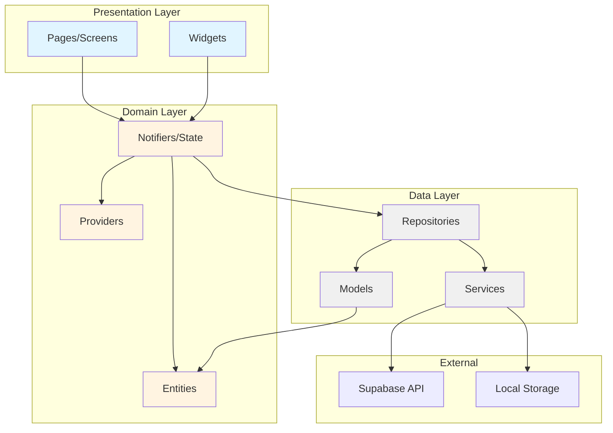

# Clean Architecture Diagram

## Dependency Rule

Dependencies flow **inward**: Presentation → Domain → Data

- **Presentation** depends on Domain
- **Domain** defines interfaces, Data implements them
- **Data** never imports Presentation
- **Domain** never imports Data or Presentation

