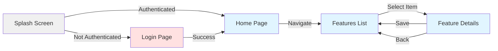

# Navigation Flow Diagram



## Route Structure

```
/                 → Splash (redirect logic)
/login            → Login Page
/home             → Home Page
/features         → Features List
/features/:id     → Feature Details (existing)
/features/new     → Feature Details (new)
```

## Navigation Methods

- **context.go()**: Replace current route (declarative)
- **context.push()**: Push new route (imperative)
- **context.pop()**: Pop current route

