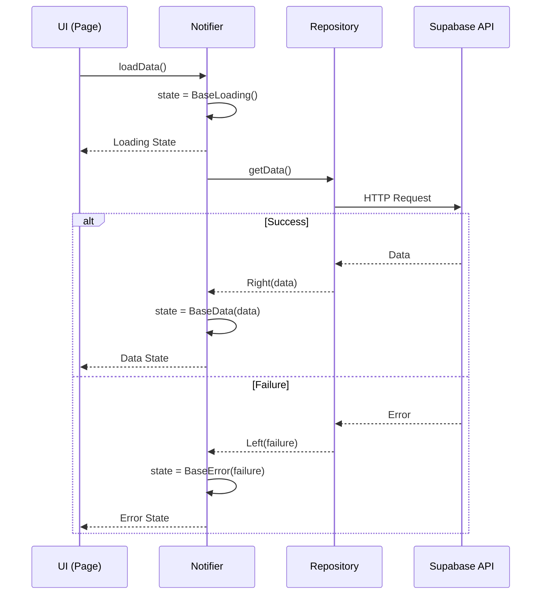

# State Management Flow

```mermaid
sequenceDiagram
    participant UI as UI (Page)
    participant Notifier as Notifier
    participant Repo as Repository
    participant API as Supabase API
    
    UI->>Notifier: loadData()
    Notifier->>Notifier: state = BaseLoading()
    Notifier-->>UI: Loading State
    
    Notifier->>Repo: getData()
    Repo->>API: HTTP Request
    
    alt Success
        API-->>Repo: Data
        Repo-->>Notifier: Right(data)
        Notifier->>Notifier: state = BaseData(data)
        Notifier-->>UI: Data State
    else Failure
        API-->>Repo: Error
        Repo-->>Notifier: Left(failure)
        Notifier->>Notifier: state = BaseError(failure)
        Notifier-->>UI: Error State
    end
```

## State Types

- **BaseInitial**: Before any operation
- **BaseLoading**: Operation in progress
- **BaseData**: Success with data
- **BaseError**: Failure with error

